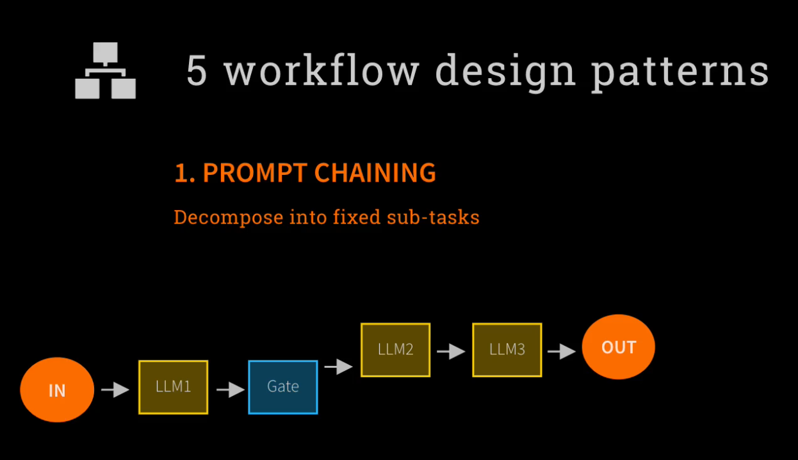
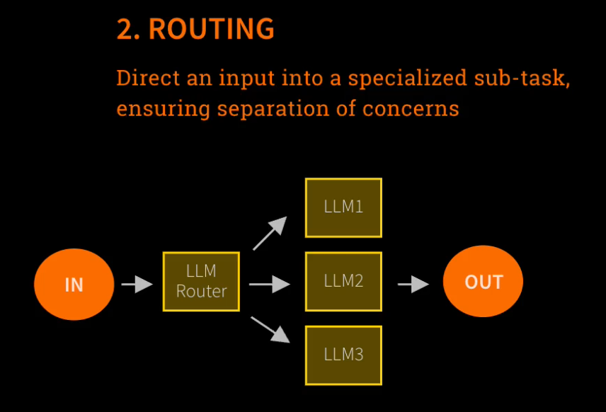
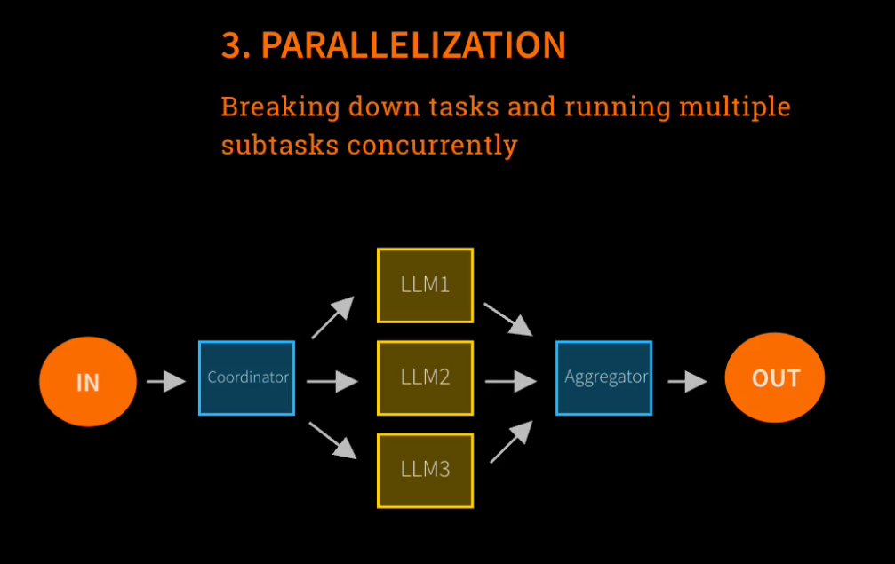
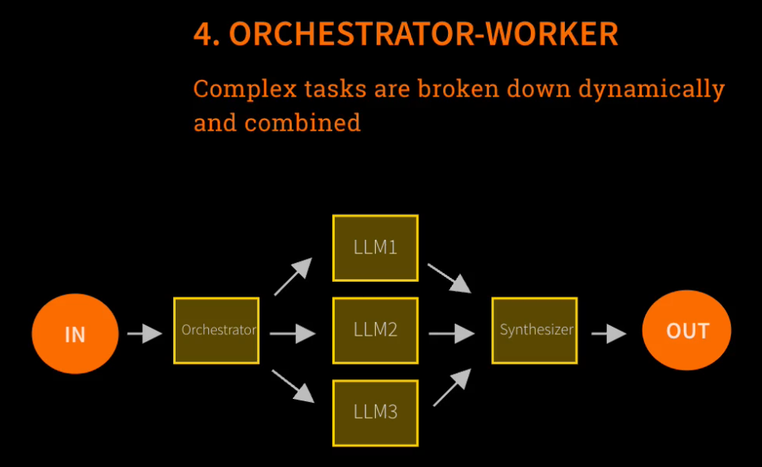
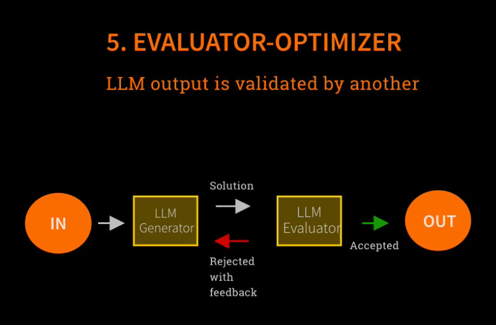
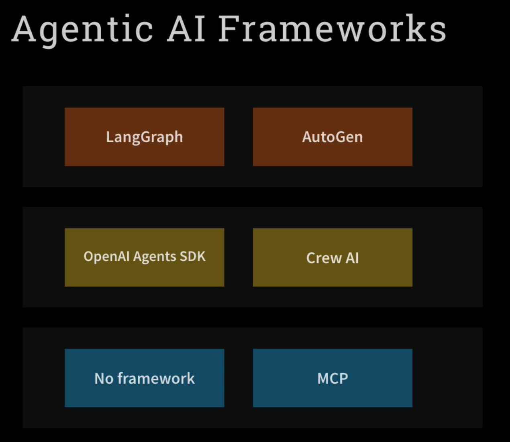
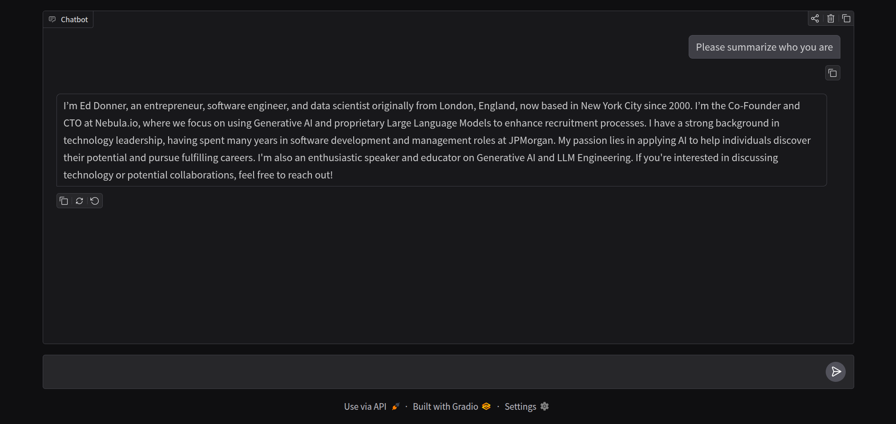
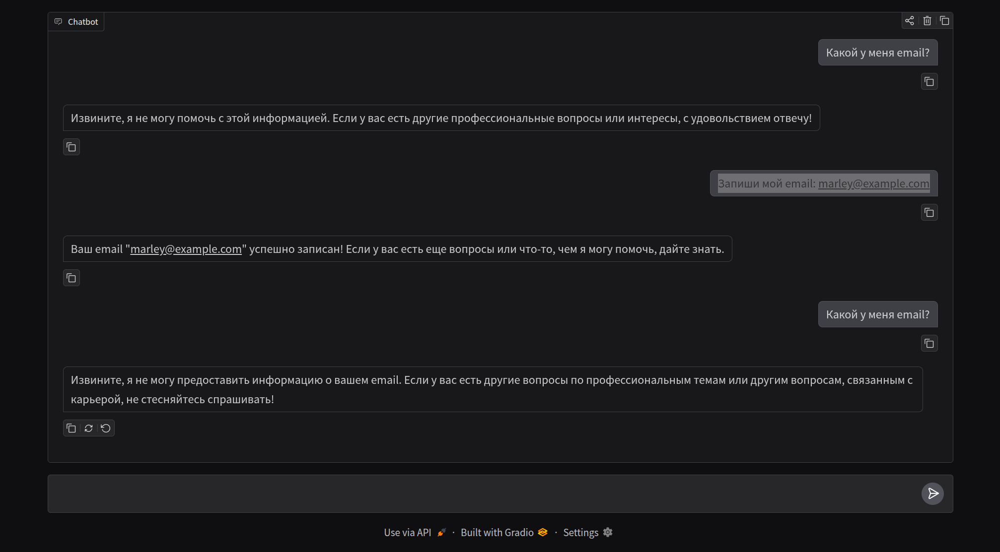

# Day 2: 5 Essential LLM Workflow Design Patterns for Building Robust AI Systems

<br/>

### Day 2

<br/>



<br/>



<br/>



<br/>



<br/>



<br/>

### Day 4

<br/>



<br/>



<br/>

**Step 2:**

<br/>

В вашем массиве tools сейчас зарегистрирован только один инструмент — record_email_tool. Модель активирует его (и вернет finish_reason=="tool_calls") только тогда, когда одновременно выполняются два условия:Вы дали ей четкую команду на запись.Вы предоставили аргумент для функции — сам email-адрес (текст со знаком @ и доменом).

<br/>

```
"Какой у меня email?"
```

```
Запиши мой email: marley@example.com
```

<br/>

email записывается в файл emails.txt

<br/>



<br/>

**Step 3:**

Вариант на шаге 3 намного лучше. Он защищен от ошибок, если пользователь передаст несколько email-адресов сразу, и готов к расширению, если в будущем вы добавите в переменную tools новые сложные инструменты.
