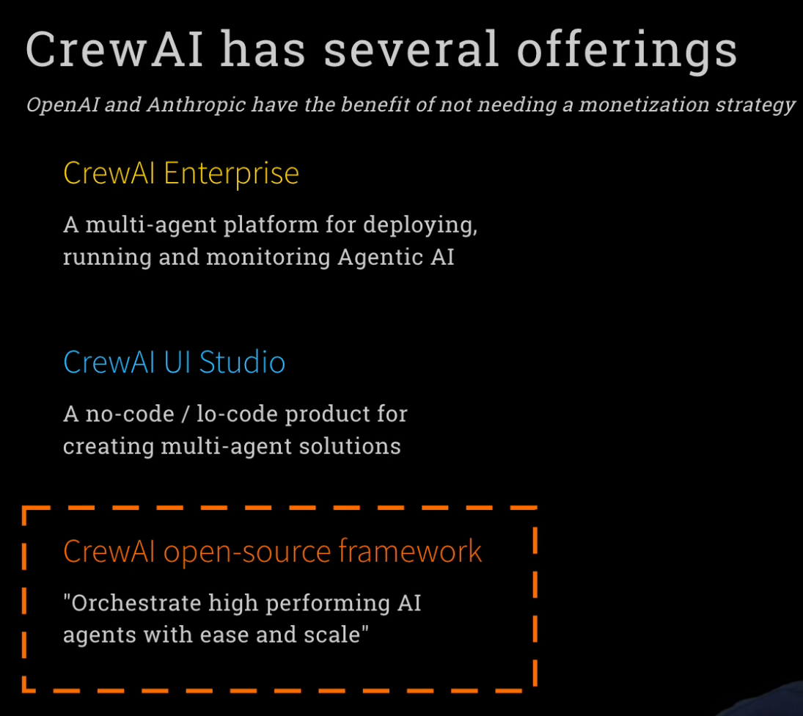
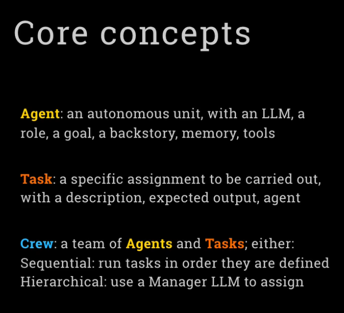
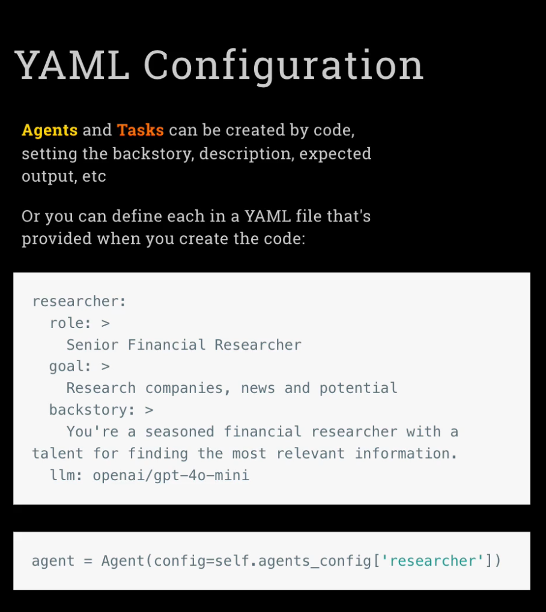
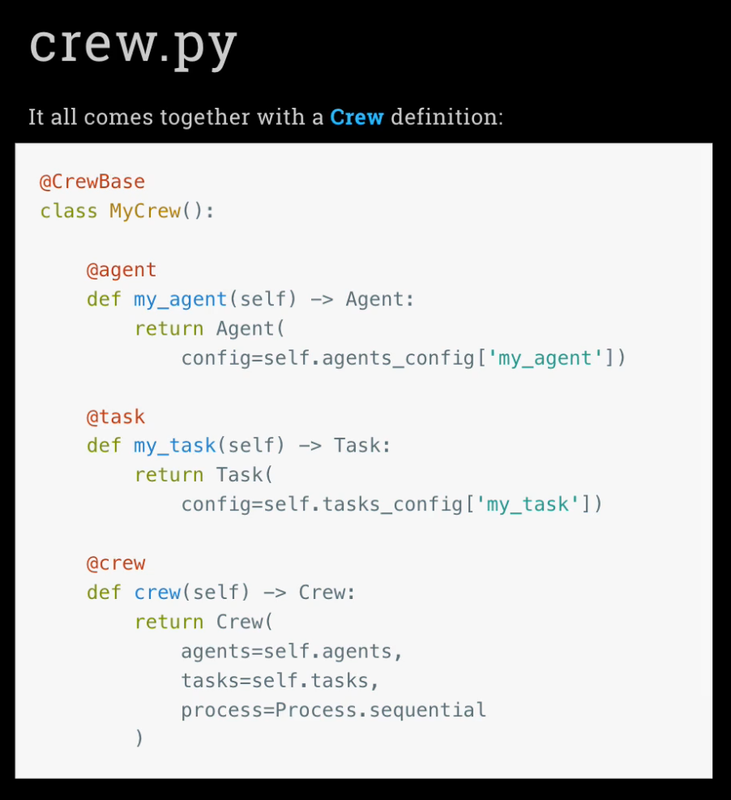
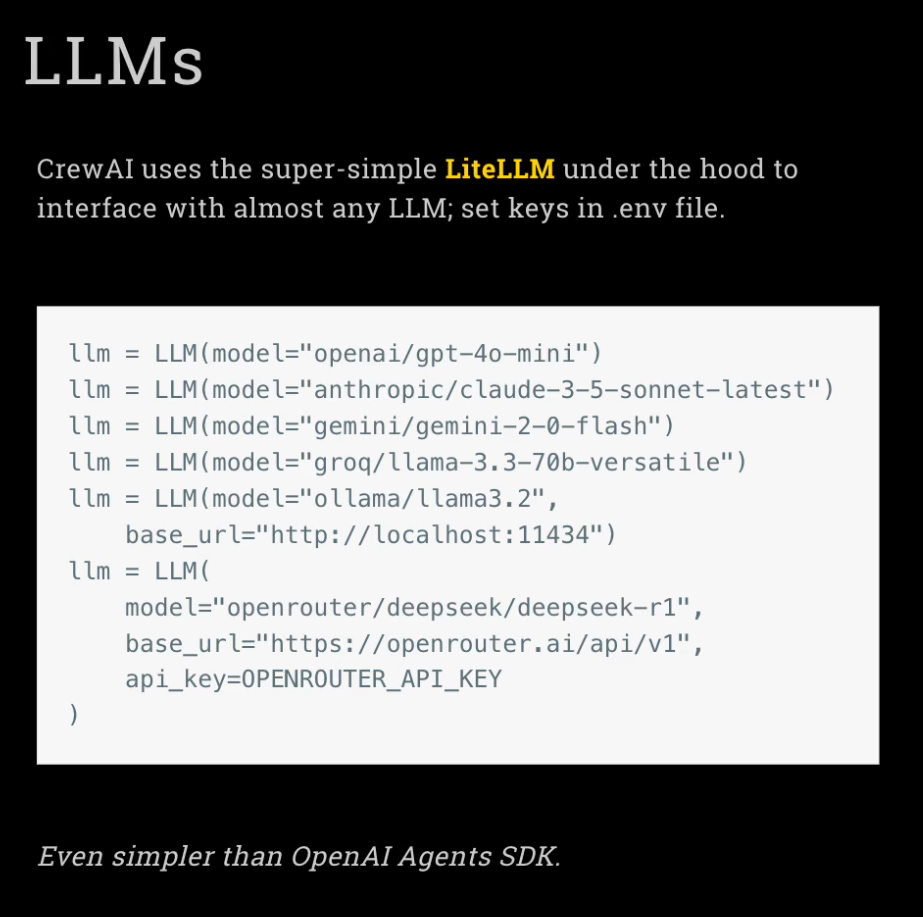
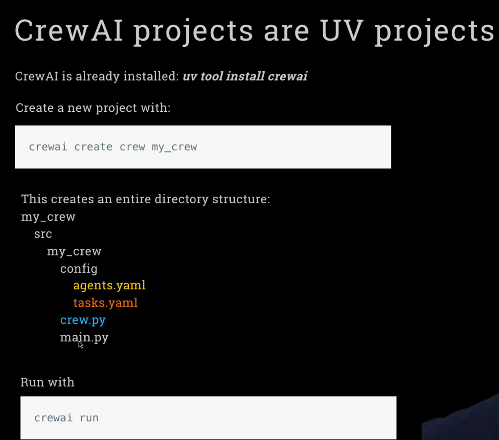
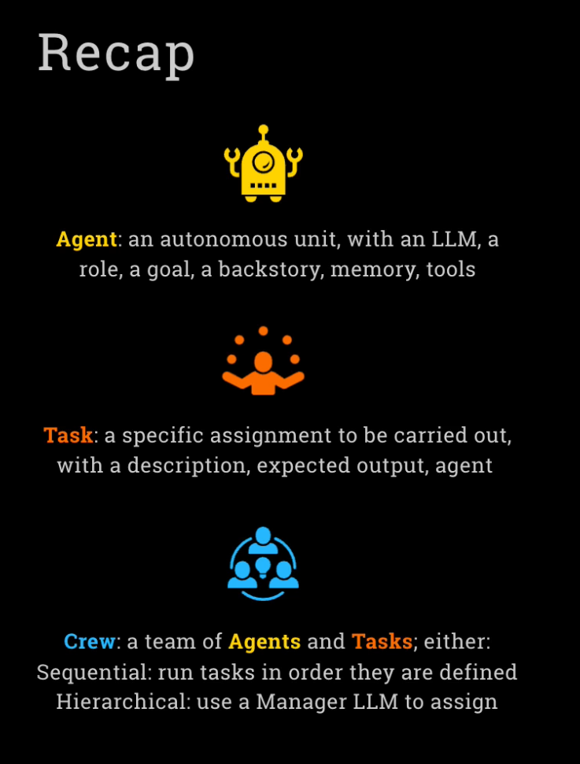
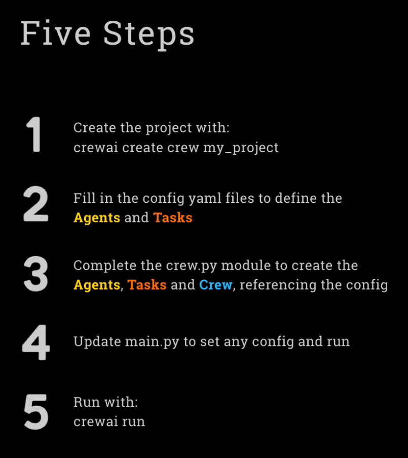
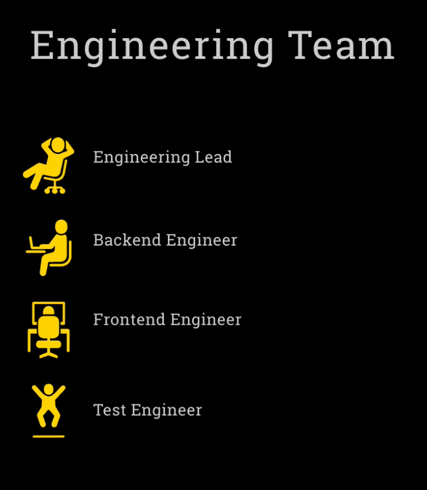
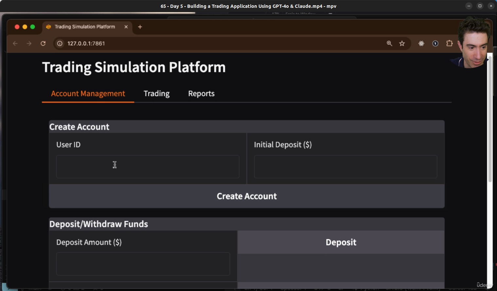

# Week 3: Crew AI Framework

<br/>

## Day 1 **Understand CrewAI Concepts**: Learn how multi-agent role-playing frameworks operate.

<br/>



<br/>



<br/>



<br/>



<br/>



<br/>



<br/>

```bash
$ crewai create crew debate
1 openai
3 gtp-4o-mini
```

<br/>

```bash
$ cd debate
$ crewai run
```

<br/>

## Day 2 **Build a Crew Agent**: Create individual specialized agents with distinct roles and goals.

<br/>



<br/>



<br/>

http://serper.dev/

<br/>

```bash
$ crewai create crew financial_researcher
1 openai
3 gtp-4o-mini

$ crewai run
```

<br/>

## Day 3

<br/>

```bash
$ crewai create crew stock_picker
1 openai
3 gtp-4o-mini

$ crewai run
```

<br/>

## Day 4

<br/>

```bash
$ crewai create crew coder
1 openai
3 gtp-4o-mini

$ crewai run
```

<br/>

## Day 5

<br/>



<br/>

```bash
$ crewai create crew engineering_team
1 openai
3 gtp-4o-mini

$ crewai run
```

<br/>


