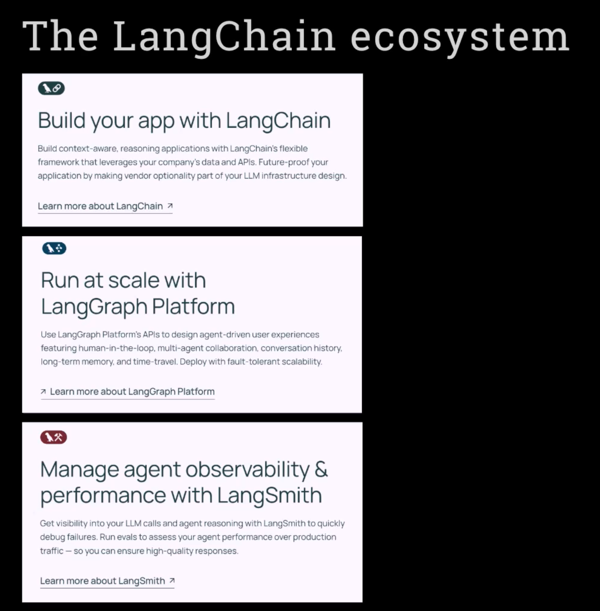
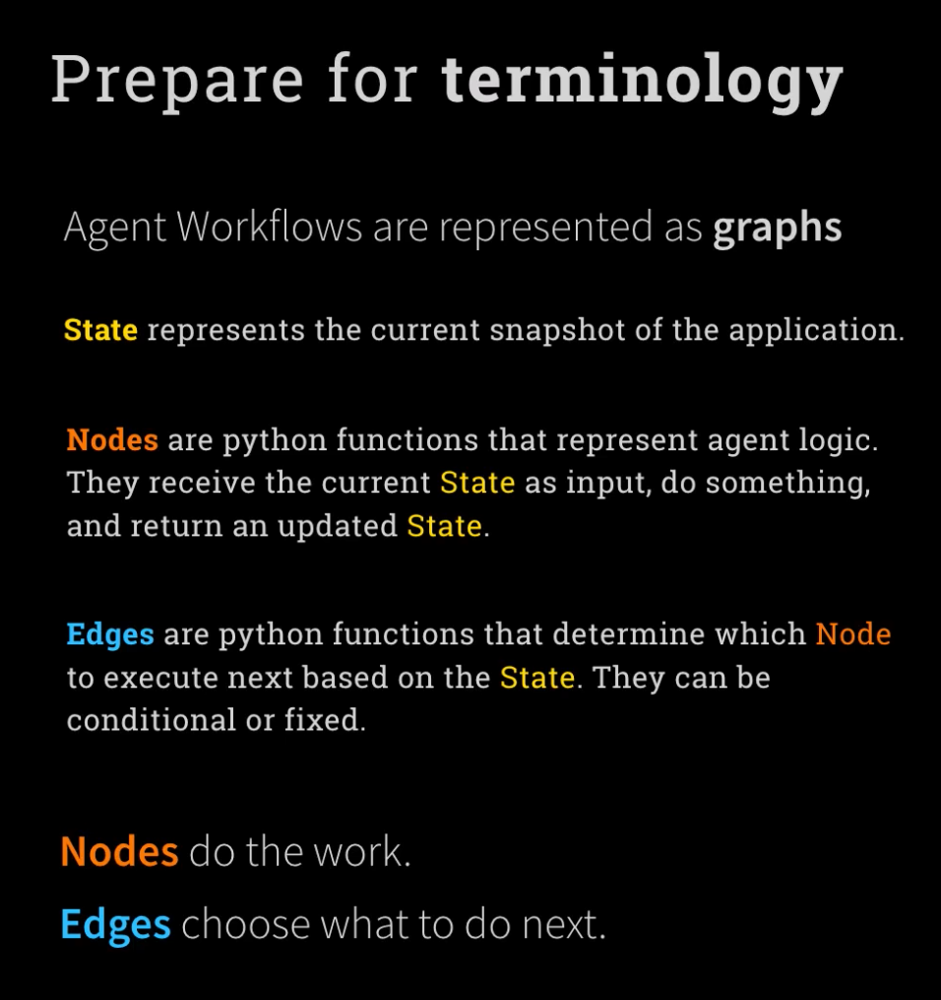
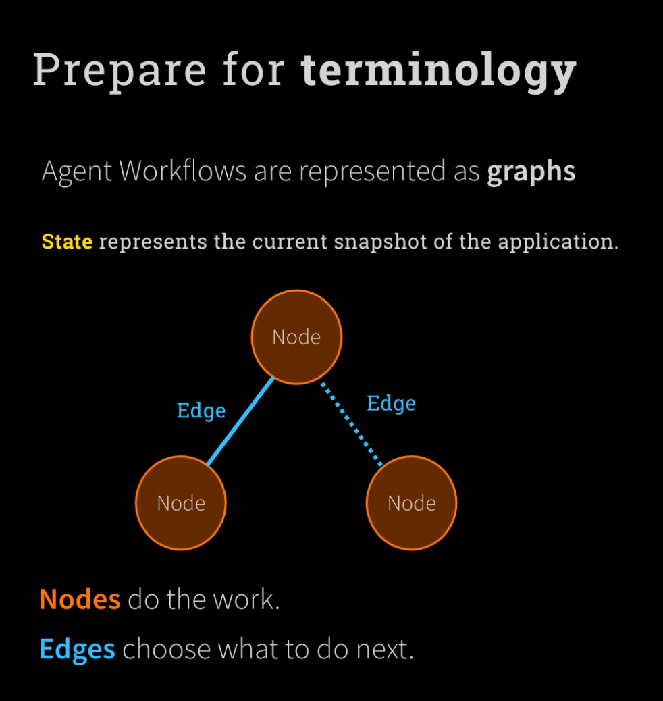
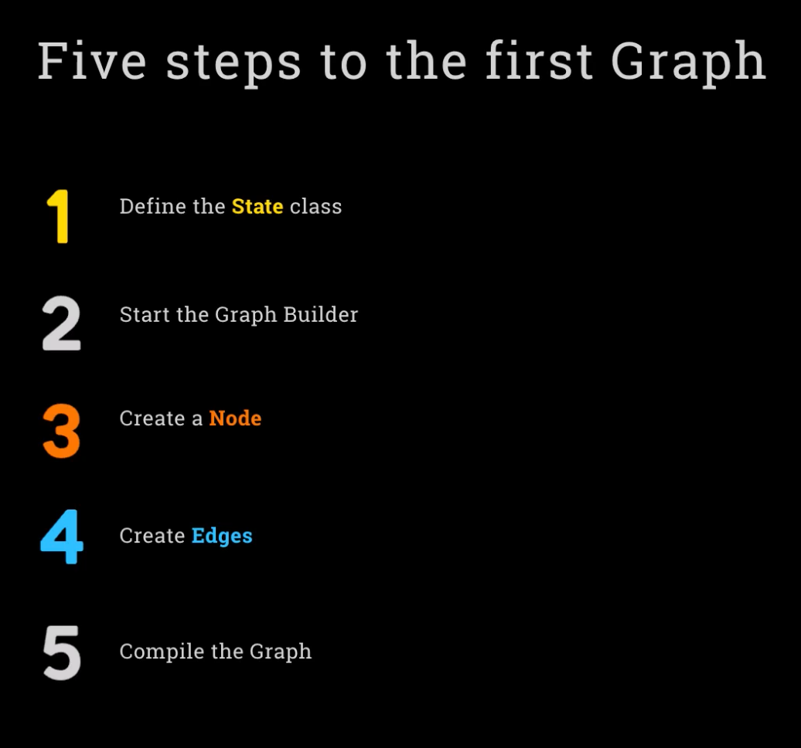

# Week 4: LangGraph

 

### Day1: **Understand LangGraph concepts**: Master cyclical graphs and state management for complex workflows.

 

 

https://www.anthropic.com/engineering/building-effective-agents

 

 

 

