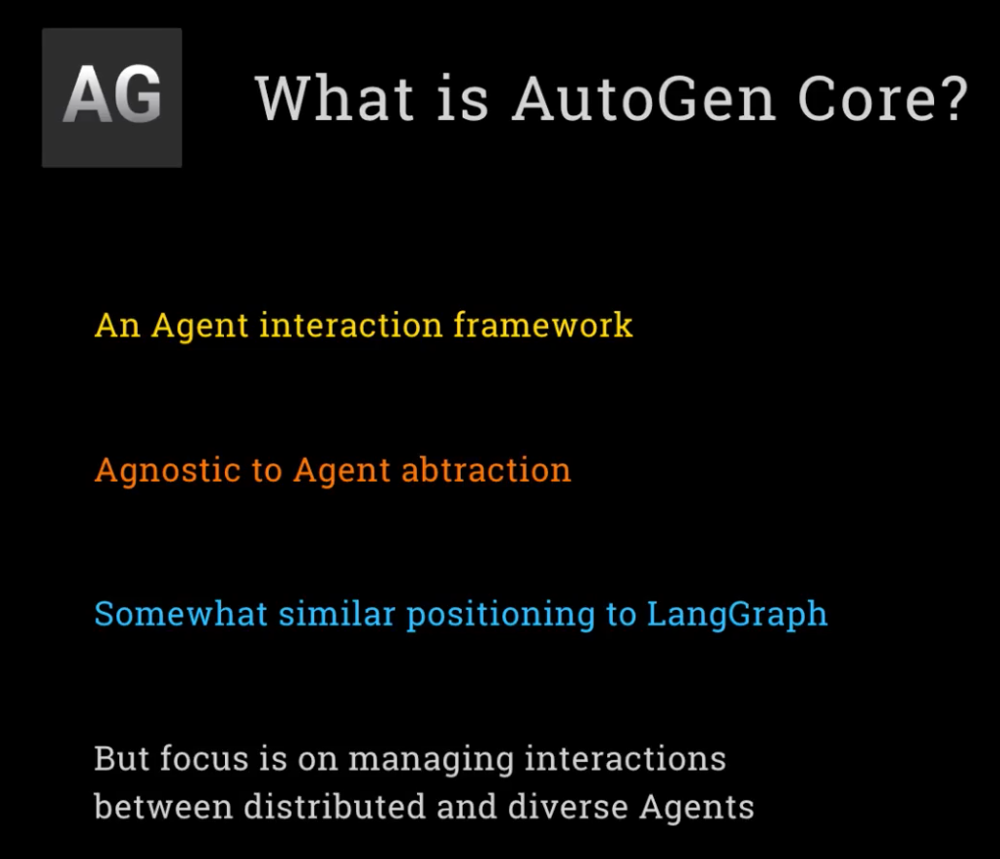
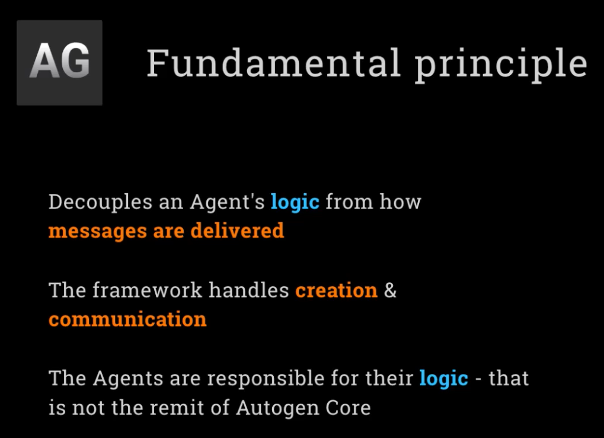
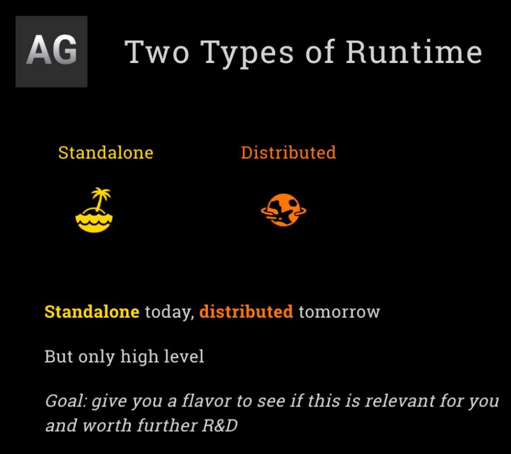
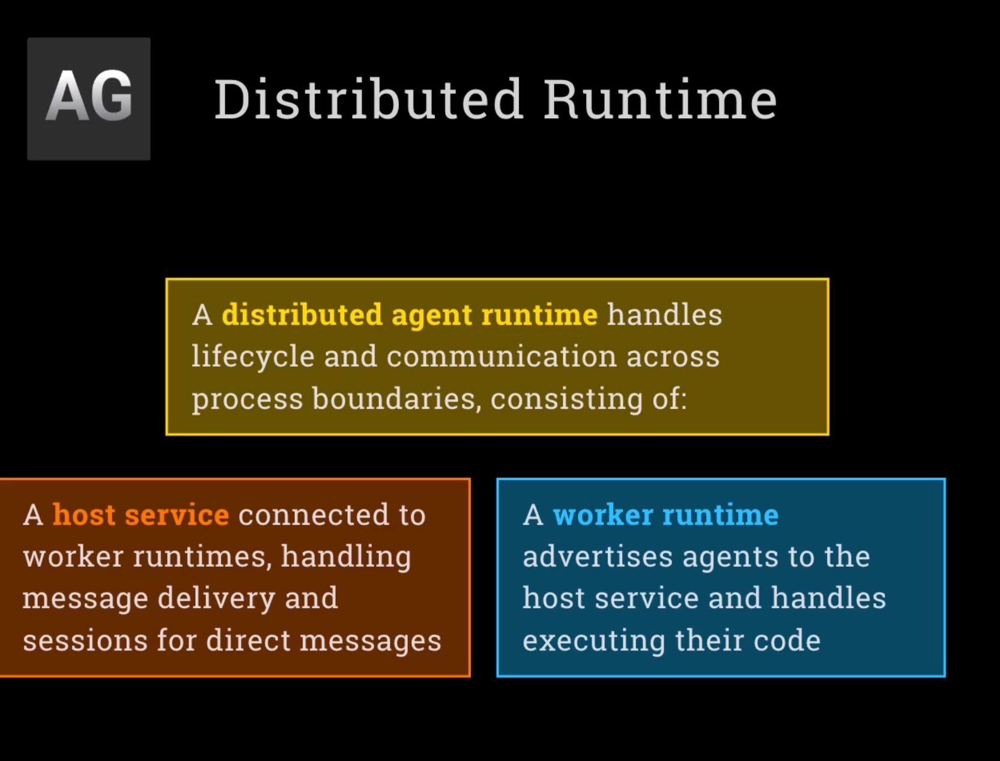

# Week 5: AutoGen

 

### Day1: **Understand AutoGen concepts**: Explore event-driven multi-agent conversation frameworks.

 

 

 

### Day3: **AutoGen Core**: Learn the foundational messaging and event routing layers of the framework.

 

 

 

 

### Day4: **AutoGen Core - distributed**: Scale agents across distributed environments and networks.

 

