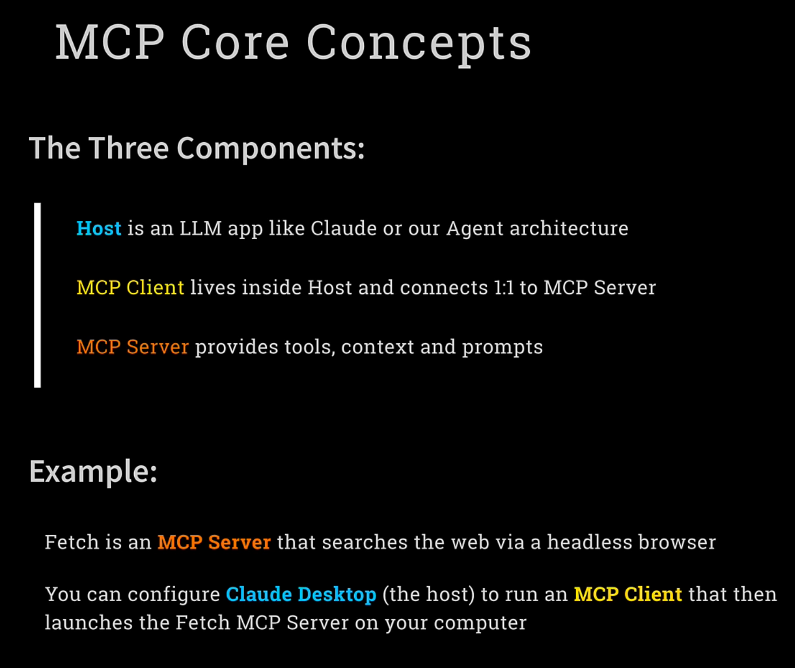
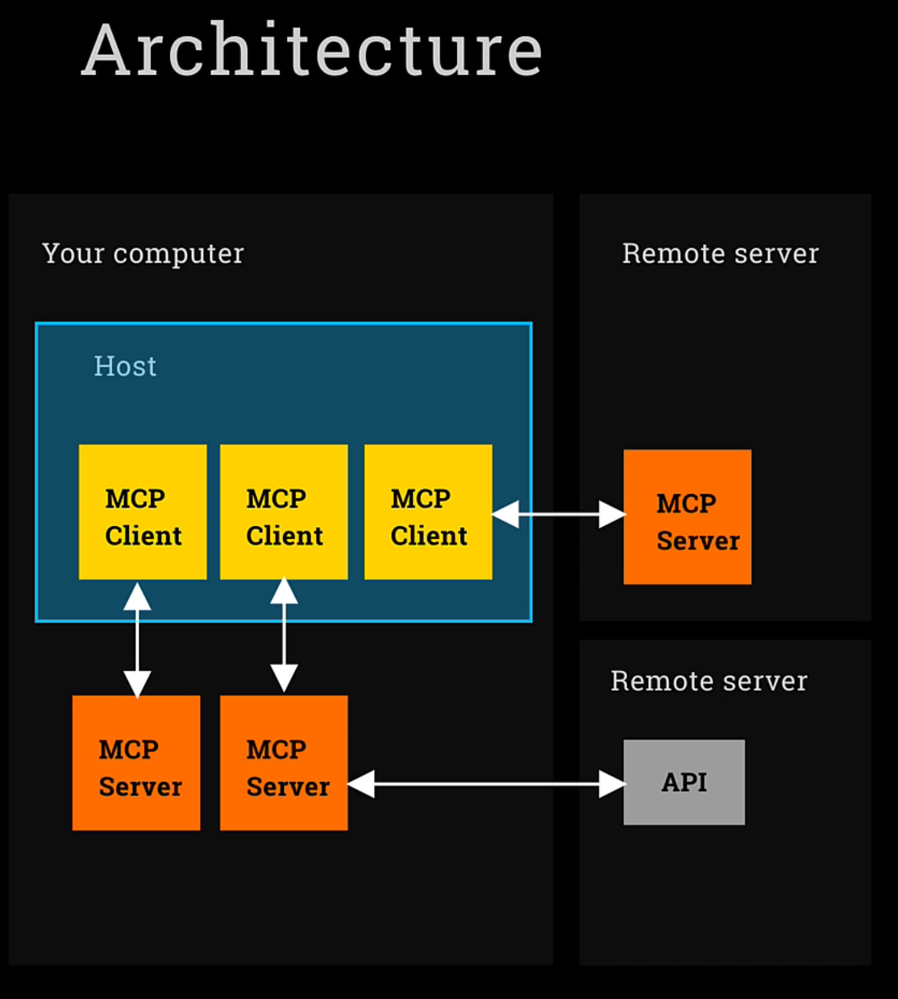
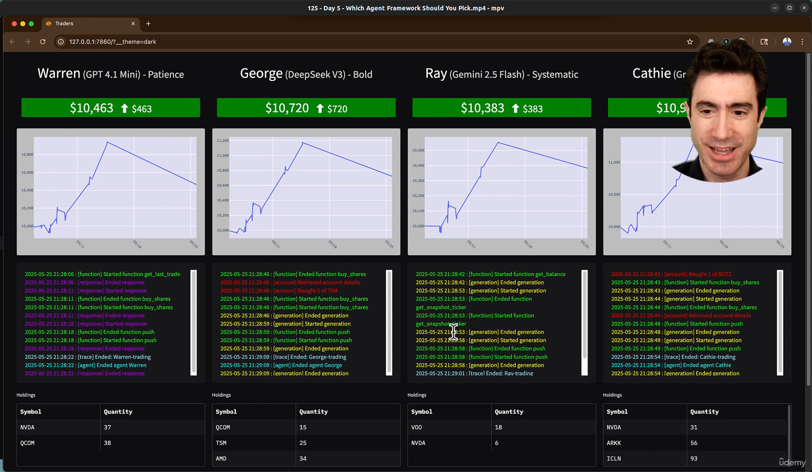
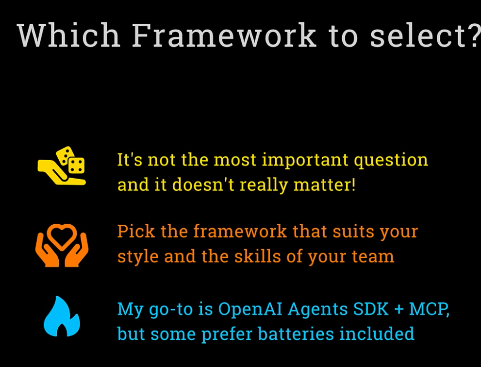

# Week 6: MCP (Model Context Protocol)

<br/>

### Day1: **Agentic Architecture and MCP**: Understand the protocol standard for connecting agents to data sources.

<br/>



<br/>



<br/>

### Now take a look at some MCP marketplaces

https://mcp.so

https://glama.ai/mcp

https://smithery.ai/

https://huggingface.co/blog/LLMhacker/top-11-essential-mcp-libraries

HuggingFace great community article:
https://huggingface.co/blog/Kseniase/mcp

<br/>

### Day5: AI Equity Traders In Action: Deploy and monitor the AI Equity Traders in a live simulated environment.

<br/>

```bash
$ uv run app.py
$ uv run trading_floor.py
```

<br/>



<br/>


