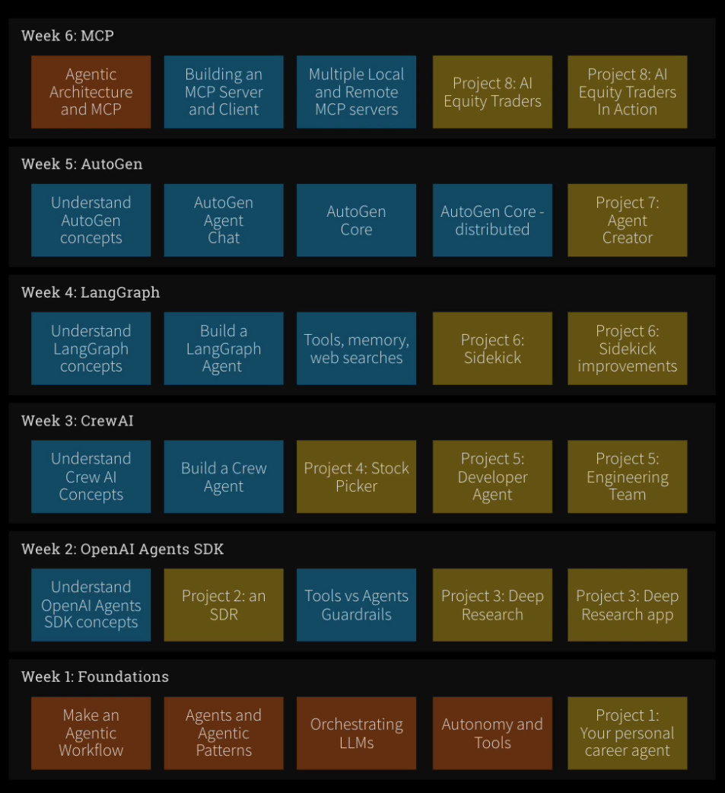

# [Ed Donner] The Complete Agentic AI Engineering Course [ENG, 2025]

**original src:**  
https://github.com/ed-donner/agents

**models:**  
https://github.com/marketplace/models

<br/>

### [Setup instructions for Linux](./setup)

<br/>

### 6 week journey to code and deploy AI Agents with OpenAI Agents SDK, CrewAI, LangGraph, AutoGen and MCP



<br/>

## Setup instructions for Linux

<br/>

```shell
$ cd setup
$ uv sync
$ source .venv/bin/activate
```

<br/>

```shell
// $ cp .env.template .env
```

<br/>

```shell
// $ python diagnostics.py
```

<br/>

## OpenAI Compatible URLs

<br/>

```python
ANTHROPIC_BASE_URL = "https://api.anthropic.com/v1/"
DEEPSEEK_BASE_URL = "https://api.deepseek.com/v1"
GEMINI_BASE_URL = "https://generativelanguage.googleapis.com/v1beta/openai/"
GITHUB_BASE_URL = "https://models.github.ai/inference"
GROQ_BASE_URL = "https://api.groq.com/openai/v1"
GROK_BASE_URL = "https://api.x.ai/v1"
OPENROUTER_BASE_URL = "https://openrouter.ai/api/v1"
OLLAMA_BASE_URL = "http://localhost:11434/v1"
```
